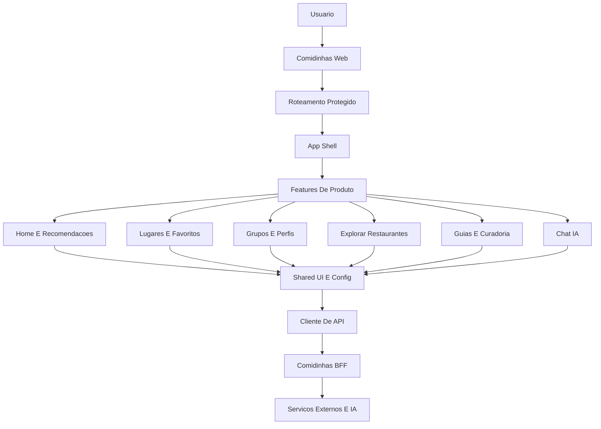

# Comidinhas Web

<p align="center">
  
  
  
  
  
</p>

<p align="center">
  <strong>O front-end do Comidinhas transforma a decisao de onde comer em uma experiencia social, inteligente e divertida.</strong>
</p>

<p align="center">
  Uma plataforma para casais, amigos e grupos descobrirem restaurantes, salvarem lugares, criarem guias, receberem sugestoes e tomarem decisoes melhores com apoio de IA.
</p>

---

## Visao De Negocio

O Comidinhas nasce para resolver um problema simples, recorrente e altamente emocional: decidir onde comer.

Mais do que listar restaurantes, o produto organiza preferencias, contexto, momentos e historico de cada pessoa ou grupo. A experiencia do front foi pensada para ser o ponto de encontro entre descoberta, decisao e memoria afetiva.

### O Que O Produto Entrega

| Frente | Valor para o usuario | Valor para o negocio |
| --- | --- | --- |
| Decisao assistida | Menos indecisao na hora de escolher onde comer | Aumenta recorrencia e engajamento |
| Lugares salvos | Organizacao de restaurantes favoritos, desejados e visitados | Cria base proprietaria de preferencias |
| Grupos e perfis | Escolhas compartilhadas por casal, amigos ou perfil individual | Expande uso social e viralidade |
| Guias | Curadoria tematica de experiencias gastronomicas | Abre caminho para conteudo premium e parcerias |
| Exploracao local | Descoberta de restaurantes proximos | Conecta intencao com acao imediata |
| IA no fluxo | Sugestoes personalizadas por contexto | Diferencial competitivo e personalizacao escalavel |

---

## Experiencia Principal

O front organiza a jornada em cinco grandes momentos:

1. **Entrar e configurar o perfil**
   Usuario cria conta, acessa seu perfil e escolhe se esta usando o Comidinhas de forma individual ou em grupo.

2. **Salvar e organizar lugares**
   Restaurantes podem ser adicionados manualmente ou a partir de busca, ficando disponiveis para consulta, status e curadoria.

3. **Explorar possibilidades**
   A area de exploracao ajuda a descobrir restaurantes proximos e transformar a vontade do momento em opcoes reais.

4. **Decidir com IA**
   O chat e os recursos inteligentes apoiam a escolha considerando contexto, preferencia e momento.

5. **Construir memoria e curadoria**
   Guias e listas tornam as escolhas reaproveitaveis, compartilhaveis e mais valiosas ao longo do tempo.

---

## Modulos Do Front

| Modulo | Papel no produto |
| --- | --- |
| **Home** | Central de decisao, recomendacoes e atalhos principais |
| **Autenticacao** | Entrada, cadastro, perfil e protecao das areas privadas |
| **Grupos** | Gestao de perfis sociais, casais, convites e solicitacoes |
| **Lugares** | Lista de restaurantes, favoritos, status e adicao rapida |
| **Explorar** | Descoberta de restaurantes proximos com apoio de dados externos |
| **Chat IA** | Interface conversacional para decidir onde comer |
| **Guias** | Curadoria de roteiros, listas e recomendacoes gastronomicas |
| **Guia IA** | Importacao e geracao assistida de guias com inteligencia artificial |
| **Shared UI** | Componentes reutilizaveis, estados visuais e padrao de experiencia |

---

## Arquitetura

O front segue uma arquitetura modular orientada por features. A aplicacao separa experiencia, dominios de produto, servicos de comunicacao e elementos compartilhados.



### Camadas

| Camada | Responsabilidade |
| --- | --- |
| **App** | Inicializacao, rotas, shell visual e estrutura global |
| **Features** | Experiencias de negocio separadas por dominio |
| **Services** | Comunicacao com o BFF e integracoes consumidas pelo front |
| **Shared** | Componentes, configuracoes e utilitarios reutilizaveis |
| **Styles** | Fundacao visual global e estilos modulares por tela |

### Principios

- **Produto primeiro:** cada tela existe para reduzir friccao na decisao gastronomica.
- **Modularidade:** novas experiencias entram como features independentes.
- **Escalabilidade de IA:** a interface ja possui pontos naturais para recomendacao, conversa, curadoria e automacao.
- **Separacao de responsabilidades:** o front cuida da experiencia; o BFF concentra regras, dados sensiveis e integracoes.
- **Experiencia social:** grupos e perfis sao tratados como parte central do produto, nao como acessorio.

---

## Tecnologias Atuais

| Tecnologia | Uso no Comidinhas Web |
| --- | --- |
| **React** | Construir a experiencia interativa, componentizada e orientada a estados |
| **TypeScript** | Dar previsibilidade ao front, reduzir erros e melhorar manutencao |
| **Vite** | Desenvolvimento rapido, build otimizado e proxy local para o BFF |
| **React Router** | Rotas publicas, rotas protegidas e navegacao entre areas do produto |
| **CSS Modules** | Estilos isolados por componente e por pagina |
| **Fetch API** | Comunicacao com o BFF por uma camada centralizada de API |
| **QRCode** | Apoio a fluxos de convite, compartilhamento e entrada em grupos |
| **ESLint** | Padronizacao de qualidade e seguranca basica de codigo |
| **Node.js** | Servir o build em producao e padronizar o runtime do projeto |
| **Railway** | Ambiente de deploy e hospedagem do BFF consumido pelo front |

---

## Tecnologias Que Ainda Vamos Usar

Foco: IA aplicada a decisao, personalizacao, curadoria e automacao de experiencias gastronomicas.

| Tecnologia futura | Para que vamos usar |
| --- | --- |
| **OpenAI API** | Conversas mais naturais, recomendacoes contextualizadas, resumo de preferencias e geracao de guias |
| **Embeddings** | Entender similaridade entre restaurantes, pratos, momentos, preferencias e historico do usuario |
| **Banco vetorial** | Buscar recomendacoes por contexto, gosto, memoria do grupo e intencao do momento |
| **RAG** | Responder com base nos lugares salvos, guias, reviews, historico e dados confiaveis do produto |
| **Function Calling / Tool Calling** | Permitir que a IA acione fluxos do produto, como sugerir, filtrar, salvar ou montar listas |
| **Agentes de IA** | Automatizar tarefas como montar roteiro de fim de semana, criar guia por bairro ou comparar opcoes |
| **Vision AI** | Ler cardapios, fotos de pratos, prints de lugares e conteudos visuais enviados pelos usuarios |
| **Speech-to-Text** | Permitir buscas e decisoes por voz, especialmente em contexto mobile e em grupo |
| **Text-to-Speech** | Criar respostas faladas para momentos em que o usuario nao quer ler ou digitar |
| **Modelos de ranking** | Priorizar recomendacoes por probabilidade de aceitacao do casal ou grupo |
| **Analytics comportamental** | Medir indecisao, tempo de escolha, preferencias recorrentes e oportunidades de personalizacao |
| **Feature flags** | Testar novas experiencias de IA com grupos controlados sem comprometer a jornada principal |

### Onde A IA Entra No Negocio

| Area | Aplicacao de IA |
| --- | --- |
| **Decisao** | Escolher a melhor opcao com base no momento, humor, clima, distancia e preferencias |
| **Personalizacao** | Aprender gostos individuais e combinacoes de grupo |
| **Curadoria** | Criar guias automaticos por bairro, ocasiao, preco, dieta ou vibe |
| **Descoberta** | Encontrar restaurantes semelhantes aos favoritos do usuario |
| **Retencao** | Sugerir experiencias no momento certo e aumentar frequencia de uso |
| **Monetizacao futura** | Viabilizar planos premium, guias inteligentes, parcerias e recomendacoes patrocinadas com transparencia |

---

## Rotas De Produto

| Rota | Experiencia |
| --- | --- |
| `/login` | Entrada do usuario |
| `/signup` | Criacao de conta |
| `/` | Home e central de decisao |
| `/chat` | IA Decide |
| `/lugares` | Lugares salvos |
| `/favoritos` | Atalho para lugares favoritos |
| `/grupos` | Gestao de grupos e perfis sociais |
| `/entrar` | Entrada em grupos |
| `/guias` | Guias gastronomicos |
| `/guias/ia` | Criacao/importacao assistida por IA |
| `/explorar` | Restaurantes proximos |
| `/restaurantes-proximos` | Descoberta geolocalizada |
| `/perfil` | Perfil do usuario |

---

## Como Rodar

### Requisitos

- Node.js 22 ou superior
- npm
- Acesso ao BFF do Comidinhas

### Instalacao

```bash
npm install
```

### Ambiente

O projeto usa `VITE_API_BASE_URL` para apontar o front para o BFF.

```bash
cp .env.example .env.local
```

Durante o desenvolvimento, o Vite tambem possui proxy para `/api` e `/health`, facilitando o teste local sem friccao de CORS.

### Desenvolvimento

```bash
npm run dev
```

### Build

```bash
npm run build
```

### Preview Local

```bash
npm run preview
```

### Servir Build

```bash
npm run start
```

---

## Qualidade E Operacao

| Comando | Objetivo |
| --- | --- |
| `npm run dev` | Rodar o front em modo desenvolvimento |
| `npm run build` | Validar TypeScript e gerar build de producao |
| `npm run lint` | Verificar qualidade e padroes de codigo |
| `npm run preview` | Testar o build localmente |
| `npm run start` | Servir a pasta `dist` em ambiente Node |

---

## Estrutura Do Projeto

```text
src/
  app/                 shell, rotas e montagem da aplicacao
  features/            dominios de negocio do produto
    ai-guides/         guias assistidos por IA
    auth/              login, cadastro, perfil e sessao
    chat/              experiencia conversacional de IA
    groups/            grupos, casais e perfis compartilhados
    guides/            curadoria e guias gastronomicos
    home/              home, recomendacoes e decisao inicial
    nearby-restaurants/ exploracao de restaurantes proximos
    places/            lugares, favoritos e listas
  shared/              API, configuracoes, UI e utilitarios
  styles/              estilos globais
```

---

## Roadmap De Produto

| Horizonte | Evolucao |
| --- | --- |
| **Agora** | Consolidar decisao, grupos, lugares salvos e exploracao |
| **Proximo** | IA mais contextual, guias inteligentes e recomendacoes personalizadas |
| **Depois** | Ranking por perfil, agentes de planejamento, voz, leitura de cardapio e automacoes |
| **Escala** | Monetizacao com premium, parcerias locais, conteudo curado e inteligencia proprietaria de preferencias |

---

## Metricas Que Importam

| Metrica | Por que importa |
| --- | --- |
| Tempo ate decidir | Mede se o produto reduz indecisao |
| Restaurantes salvos por usuario | Mede criacao de base de preferencias |
| Uso por grupo | Mede valor social e viralidade |
| Retorno semanal | Mede habito |
| Cliques em recomendacoes | Mede qualidade da IA |
| Guias criados | Mede potencial de curadoria e monetizacao |
| Conversoes de exploracao | Mede capacidade de transformar descoberta em acao |

---

## Posicionamento

O Comidinhas Web e a camada de experiencia de um produto que combina relacionamento, descoberta local e inteligencia artificial.

Ele nao quer ser apenas uma lista de restaurantes. Ele quer ser o lugar onde pessoas decidem melhor, lembram do que viveram e descobrem o proximo role com menos atrito e mais personalidade.

